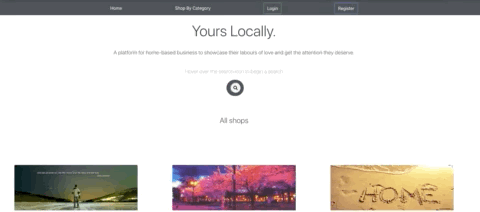

# YoursLocally

## Content Page
  * [Description](#description)
  * [Inspiration](#inspiration)
  * [Initialization](#initialization)
  * [Features](#features)
  * [Tech Stacks](#techstacks)

### Description

YoursLocally is a community for home based businesses to showcase their labors of love and get the attention they deserve - from people who are passionate about supporting local talent.

### Inspiration

Person A has lost her job due to COVID-19 layoffs. She is an avid baker and is seeking to get some income by doing what she loves best: baking. However, she finds it challenging to advertise the delicious cakes that she makes. Going onto cluttered platforms like Facebook and Carousell means she has to fight with a lot of other messaging and products to be heard. She is looking for alternatives where her cakes won’t just be “one of many” products.

Person B is a white collar professional who supports local talents and wares, and likes consuming things that are not too mainstream or commercial, as it is a way for her to express her individuality. She usually discovers home grown brands at local flea markets, but due to COVID-19, there are much lesser of such events. Hence, she is looking for a curated online experience for her to find out more about interesting wares.

### Initialization

You can fork this repo or

Alternatively, visit [YoursLocally](https://yours-locally.herokuapp.com/). Hosted on Heroku.

## Features

Start By creating an account and select type as either user or seller depending who you are.

You will then be directed to the login page, and just key in your registered username and password to begin.

In the home page you can search for the listings you are looking for or shop via category.

Sellers are able to perform CRUD operations on both their individual shops and listings

Users are able to favorite shops as well as leave reviews

Last but not least, both users and sellers are able to communicate with one another via enquiries and can be accessed via the inbox in the navigation bar.

## Tech stacks used

Javascript, ReactJS, Bootstrap, PostgreSQL